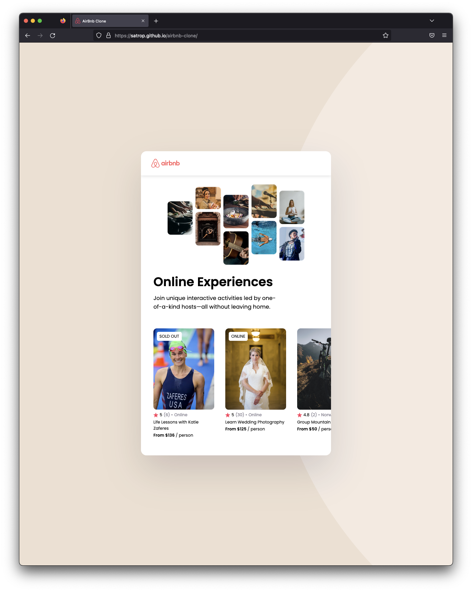

# Frontend Mentor - Portfolio

## [Live Site](https://satrop.github.io/airbnb-clone/)

### Built with ❤️

-   Worked with a Figma file for the design
-   All build using React
-   Styled With SCSS
-   Utilized Flexbox
-   Semantic HTML5 markup
-   Mobile-first workflow

---

### What I learned

-   Better understanding of mapping over data
-   Better understanding of passing `props` from the data to a component
